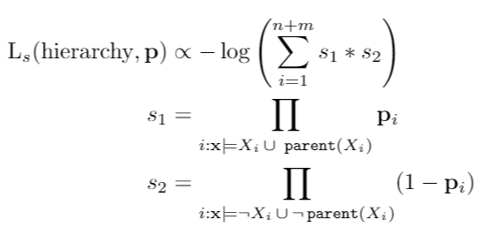

<h2 align="center">
  Exploring semi-supervised learning with the Semantic Loss
</h2>

<p align="justify">
(Xu et al., 2017) explore augmenting the process of learning a statistical model with additionalknowledge of theoutput domainof the model. This paves the way to inject existing knowledge intothe model via a loss term which optimizes how close the model is from satisfying the constraintson the output domain. In this project, we (a) explore how semantic loss behaves in simple datasets, (b) reproduce the results on Fashion MNIST dataset, (c) extend the work by using a simple class hierarchy and compare it with a baseline model which is trained without a semantic loss.
</p>

<p align="justify">
Our initial findings show that due to a strong signal from semantic loss, tuning the weight hyperparameter, w is important. Too  low,  and there  is no  learning signal that  the SL  provides.  Too high,  and  the model fails to perform well.  A high value of w actually hurts the performance of the models in GaussianBlobs; we found the worse performing models have w= 10.  Having a low w doesn’t necessarily improve the performance, however. For instance, setting w < 0.001 lowers the performance forexperiments involving Gaussian Blobs.
</p>

## Install and Run

```
pip3 install https://download.pytorch.org/whl/cpu/torch-1.0.1.post2-cp36-cp36m-linux_x86_64.whl
pip3 install torchvision
pip install -r requirements.txt

mkdir logs
```
#### Conda environment
```
conda env create -f environment.yml
conda activate symstat
```

#### Usage
```
python symstat.py train --model=sl --model-id=1 --unlabeled=0.998 --batch-size=128 --epochs=50 --num-workers=4
```

## Results

<h4> Isotropic Gaussian blobs </h4>

| Unlabeled %          | 90         | 75           |  50        | 25              | 10               |
| --------             | :-----:    | :-------:    | :-----:    | :-------------: | :--------------: |
| **Baseline (no SL)** | 63         | 31           | 40.5       | 24              | 57.5             |
| **SL (best w)**      | 63.5 (0.1) | 85.5 (0.001) | 63.5 (0.1) | 49.5 (1.0)      | 73.0 (0.001)     |

<h4> Fashion MNIST </h4>

| Model    | Labeled | Unlabeled | CE Loss | Sem Loss (lab)  | Sem Loss (unlab) | Accuracy   |
| -------- | :-----: | :-------: | :-----: | :-------------: | :--------------: | -------:   |
| Baseline | 120     | 0         | Yes     | No              | No               | 0.6204     |
|          | 120     | 0         | Yes     | No              | Yes (w_s = 0.5)  | 0.2716     |
|          | 120     | All       | Yes     | No              | Yes (annealed)   | **0.6545** |
|          | 120     | All       | Yes     | Yes (annealed)  | Yes (annealed)   | 0.6449     |

<h4> Fashion MNIST with a simple class hierarchy </h4>

<p align="justify">
We add two classes Top and Shoes to the already existing classes. Both of them are parent classes.  The children of Top = {T-shirt/top, Pullover, Coat, Shirt} and  of Shoes = {Sandal, Sneaker, Ankle boot}.  Given (n+m) classes (n represents number of ‘child’ classes while m represents number of ‘parent’ classes). The semantic loss can be written as,
</p>

<div align="left">
  
</div>

<h3> References </h3>

<ol>
  <li align="justify"> Xu et al. (2018). A Semantic Loss Function for Deep Learning with Symbolic Knowledge. <i> arXiv preprint arXiv:1711.11157 </i>. </li>
  <li align="justify"> Xiao et al. (2017). Fashion-MNIST: a Novel Image Dataset for Benchmarking Machine Learning Algorithms. <i> arXiv preprint arXiv:1708.07747 </i>. </li>
</ol>
