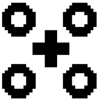

<div class="container">
  <div class="row">
    <div class="col-sm">
      
    </div>
    <div class="col">
      <h1 align="justify">
        Towards abstract symbol learning
      </h1>
    </div>
  </div>
</div>

<p align="justify">
Following the architecture proposed by Garnelo et al. (2016) we will explore its transfer learning capabilities. When a new situation is encountered, the system needs to hypothesize or find similarities (objects or elements)  with previously encountered scenarios. This can be done by introducing separate Q-functions for each task and then  take the composition of the Q-functions (Niekerk et al. (2018)).
</p>

<p align="justify">
Garnelo et al. (2016) experiment with a toy example having only two types of components/objects (positive and negative). If the system is able to classify different types of positive and negative objects, it would be a step towards solving the task of combining various objects into categories (a task at which humans excel). Ideally, the agent would then be able to solve new tasks without training/learning.
</p>

<h3> Execution </h3>

```
python src/game.py interactive|steps|experiments
```

<h3> References </h3>

<ol>
  <li align="justify"> Garnelo et al. (2016). Towards deep symbolic reinforcement learning. <i> arXiv preprint arXiv:1609.05518 </i>. </li>
  <li align="justify"> Niekerk et al. (2018). Will it blend? Composing value functions in reinforcement learning. <i> arXiv preprint arXiv:1807.04439 </i>. </li>
</ol>
